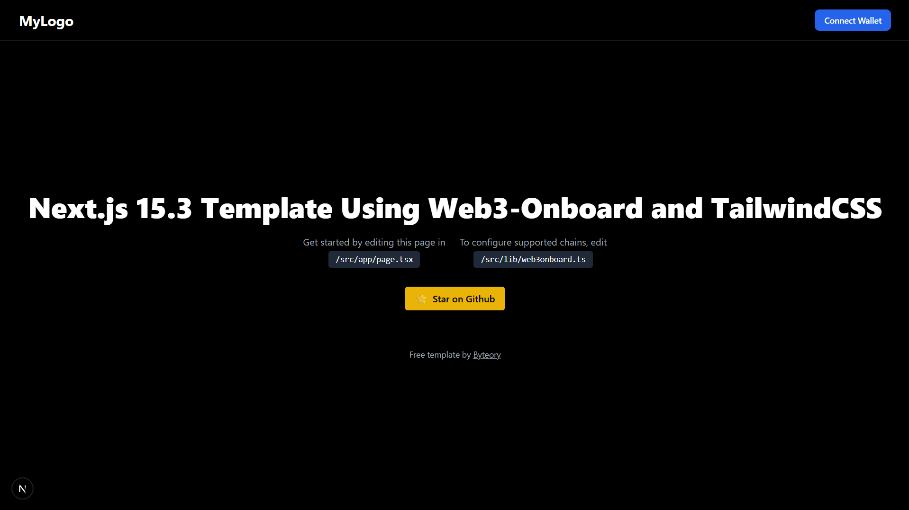

# 🧪 Next.js 14.1 Web3-Onboard Starter Template

A sleek starter template built with **Next.js 14.1**, **Web3-Onboard**, **Tailwind CSS**, and **TypeScript** — ideal for modern Web3 dApps.

> 🔥 Perfect for wallet connection, EVM chain support, and rapid UI customization.

## 🖼️ Preview




---

## 🚀 Tech Stack

* **Next.js 14.1 (App Router)**
* **Web3-Onboard** – Wallet connect modal & multi-wallet support
* **Tailwind CSS** – Utility-first styling
* **TypeScript** – For type safety
* **React 18**

---

## 📂 File Structure

```
src/
├─ app/          → App Router structure
│  └─ page.tsx   → Main UI page
├─ lib/          → Configuration files (web3onboard.ts)
├─ providers/    → React providers
└─ components/   → Add your UI components here
```

---

## 🔧 Configuration

### Environment Variables

Create a `.env.local` file in the root directory with the following:

```
NEXT_PUBLIC_WALLETCONNECT_PROJECT_ID=your_project_id_here
```

### Supported Chains

To modify supported chains, edit:

```typescript
// src/lib/web3onboard.ts
const chains = [
  // ...your supported EVM chains
];
```

To start customizing, edit:

```
/src/app/page.tsx
```

---

💡 **Features**

* Wallet connection (MetaMask, WalletConnect, Coinbase, etc.)
* Multi-chain EVM support (Ethereum, Polygon, Arbitrum, Base, etc.)
* Clean, dark theme-ready layout
* Easily extendable for any Web3 use case
* TypeScript-first, modern Next.js App Router structure

---

📦 **Getting Started**

```bash
yarn install
# or
npm install

yarn dev
# or
npm run dev
```

---

⭐ **Credits**  
Free template by [Byteory](https://byteory.com)

Don't forget to 🌟 the repo if you found it useful!

---

📜 **License**  
MIT — free to use and modify. 